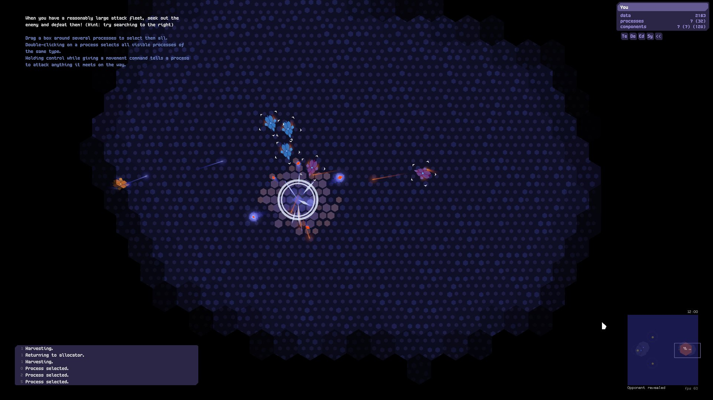

Last week the Liberation Circuit game was [announced on Reddit](https://www.reddit.com/r/gamedev/comments/5yvl4o/i_finished_my_game_liberation_circuit_rogue_ai/). This game is a Rogue A.I. simulator that is, which is impressive, written on pure C.

The author of the game released it on Github and a compiled [Windows version](https://github.com/linleyh/liberation-circuit/releases/tag/v1.0) is provided. Linux compilation is possible if we install the required libraries.

However, as usual in these cases, the compilation on Linux is not an easy task. The users [started to report](https://github.com/linleyh/liberation-circuit/issues/8) problems with `cmake` with some workarounds. At this point I started to wonder if it is possible to create a docker image for this game and then save some time to users just to give a try. 

I know that Jessie Frazelle has [a very cool repo](https://github.com/jessfraz/dockerfiles) with a lot of desktop application inside docker containers. This is maybe not the usual usage of docker, but it's possible and fun :). So, using her dockerfiles I create this one: 

```
FROM ubuntu:16.04
LABEL maintainer "Erich Cordoba <erich.cm@yandex.com>"

RUN apt-get update && apt-get install -y liballegro5-dev build-essential git

RUN git clone https://github.com/linleyh/liberation-circuit.git /src
WORKDIR /src/
RUN ./do && cp src/g_game bin/

ENV HOME /home/liberation
RUN useradd --create-home --home-dir $HOME liberation \
    && chown -R liberation:liberation $HOME \
    && usermod -a -G audio,video liberation

USER liberation

WORKDIR /src/bin/
ENTRYPOINT [ "./g_game" ]
```

The docker image is an Ubuntu 16.04 with the `build-essential` and `liballegro5` dependencies. Then just downloads the source code and start the compilation. I create and additional user and set the `ENTRYPOINT` to binary of the game.

The trick on having graphical applications running with docker is to pass the correct variable to the instace. So to run this image the following command is used: 

```
docker run -e DISPLAY=$DISPLAY -v /tmp/.X11-unix:/tmp/.X11-unix --device /dev/dri --device /dev/snd:/dev/snd erichcm/liberation-circuit
```

The `-e DISPLAY=$DISPLAY` defines the `DISPLAY` environment variable to the display running the system. Then the `/tmp/.X11-unix` is shared between the docker instance and the host system. The same happens with the `/dev/dri` and `/dev/snd` to enable sound.

At this point, you already noticed that the image is available on `erichcm/liberation-circuit` and can be downloaded using:

```
docker pull erichcm/liberation-circuit
```

A sample of the game running. 

